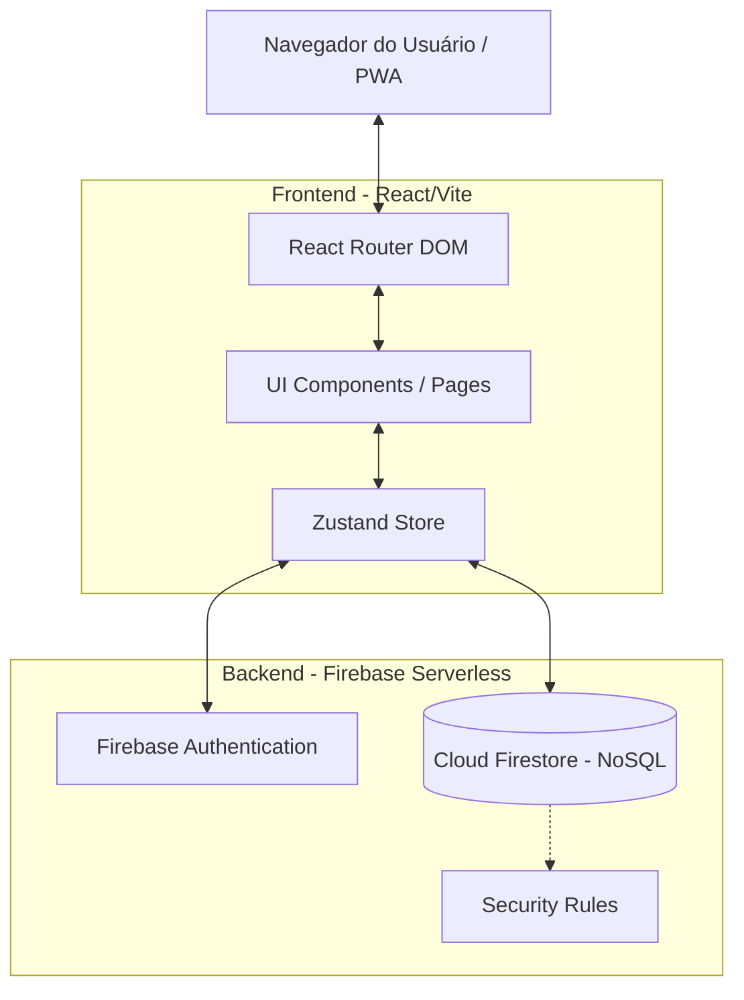
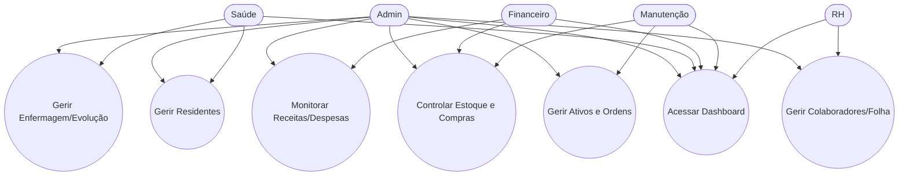

# Arquitetura e Fluxo da Aplicação

O ClinicCare adota uma arquitetura baseada em **SPA (Single Page Application)** com o Frontend diretamente integrado a recursos Serverless do **Firebase**.

## Diagrama de Referência Geral

## Separação de Módulos (Pages)

O sistema é segmentado fortemente por perfis de acesso, que determinam o que cada usuário enxerga e opera:

- **`admin`**: Acesso completo.
- **`saude`**: Acesso aos módulos `Residents`, `Nursing` e `EPrescription`.
- **`financeiro`**: Acesso aos módulos `Financial` e `Inventory`.
- **`manutencao`**: Acesso aos módulos `Maintenance` e `Inventory`.
- **`rh`**: Acesso ao módulo `HR`.

### Fluxo de Casos de Uso (Role-based)

## Fluxo de Estado Global (Zustand)

A aplicação faz intenso uso do `Zustand` para refletir os dados em tempo real a partir de `onSnapshot` (Firebase Firestore). Isso garante que mudanças feitas por qualquer usuário propaguem instantaneamente para telas ativas:

1. `App.tsx` invoca a action `initializeListeners` do Zustand.
2. O Zustand abre *websockets* (`onSnapshot`) com todas as principais coleções permitidas para o usuário logado (baseado no Role/Rules).
3. Atualizações alimentam automaticamente as listas globais na memória (e.g. `state.residents`, `state.medications`).
4. Quando o usuário clica em "Salvar" na interface, o Zustand invoca a gravação (`addDoc` / `updateDoc`), o Firestore confirma a transação e o listener reativa o ciclo notificando todos os clientes.
