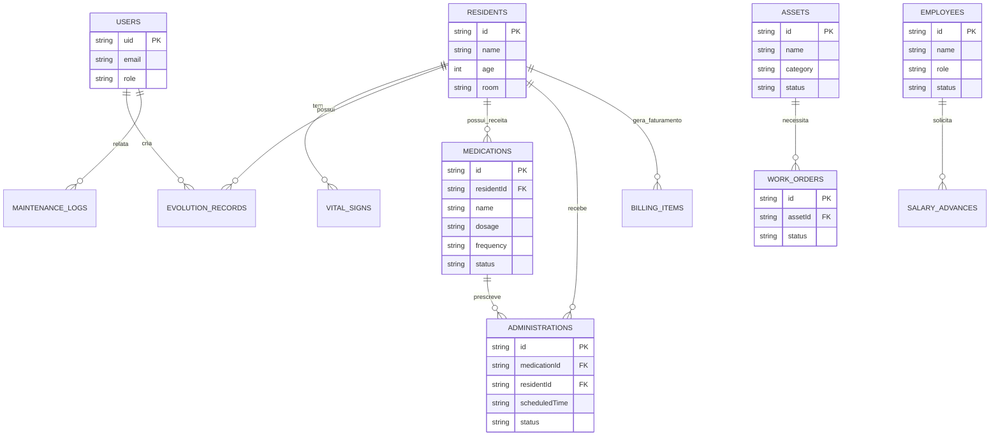

# Modelagem de Dados

O ClinicCare utiliza **Cloud Firestore** do Firebase, um banco de dados NoSQL (orientado a documentos).
Neste formato, evitamos relacionamentos complexos (`JOINs`) sempre que possível, embora a aplicação relacione vários documentos utilizando *foreign keys* lógicas (IDs gerados de outras coleções, como `residentId` e `medicationId`).

## Diagrama Entidade-Relacionamento

## Dicionário Rápido de Documentos / Coleções

| Coleção Firestore | Função Principal | Principais Campos |
|:---|:---|:---|
| **`users`** | Armazena a *Role* de autorização. | `role`, `displayName` |
| **`residents`** | Cadastro principal de Idosos / Pacientes. | `name`, `age`, `room`, `status` |
| **`medications`** | Prescrições geradas associadas ao paciente. | `residentId`, `name`, `dosage`, `frequency` |
| **`administrations`**| Horários gerados para aplicação e check do enfermeiro. | `medicationId`, `scheduledTime`, `status` |
| **`billingItems`**| Cobranças fixas/variáveis geradas para o hóspede. | `residentId`, `amount`, `status`, `type` |
| **`inventoryItems`**| Cadastro de produtos de estoque/farmácia/alimentação.| `name`, `quantity`, `minQuantity`, `category` |
| **`assets`** | Equipamentos/Leitos (Módulo de Manutenção). | `name`, `category`, `status` |
| **`employees`** | Ficha do funcionário (Módulo HR). | `name`, `role`, `salary`, `status` |
| **`workOrders`** | Ordem de serviço para manutenção. | `assetId`, `description`, `status` |
| **`salaryAdvances`**| Adiantamento de folha de pagamento. | `employeeId`, `amount`, `status` |

*OBS: Os IDs das chaves primárias são gerados automaticamente pelo próprio Firestore via `addDoc()` ou manualmente pré-configurados. Recomendamos que nunca alterem diretamente as referências cruzadas sem atualizar toda a árvore no backend.*
